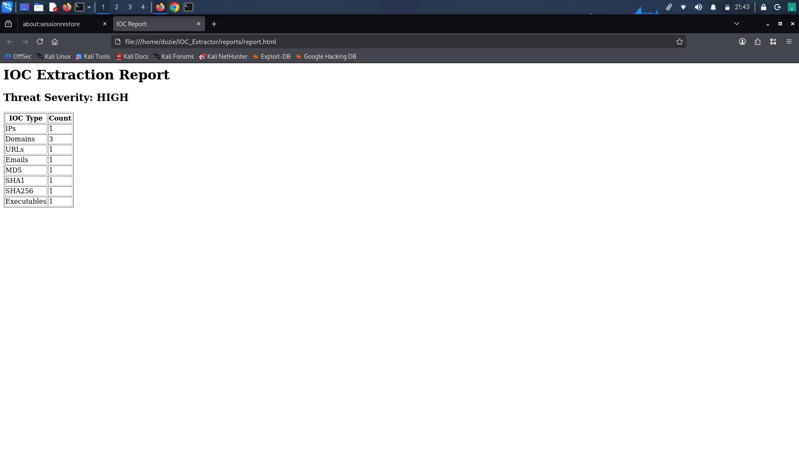
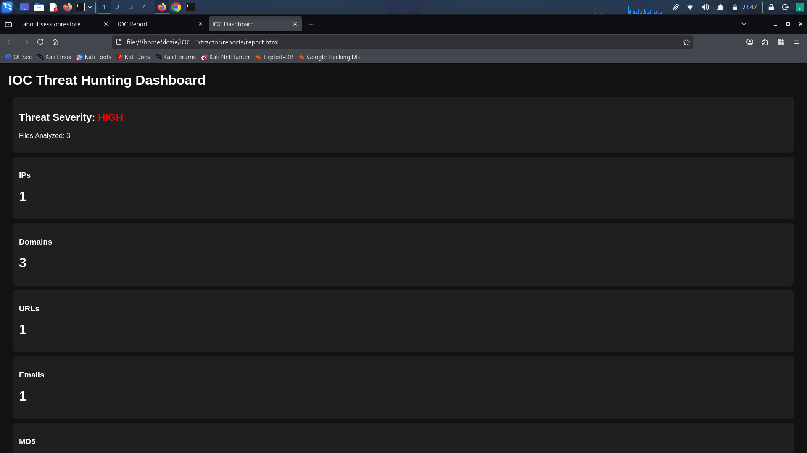
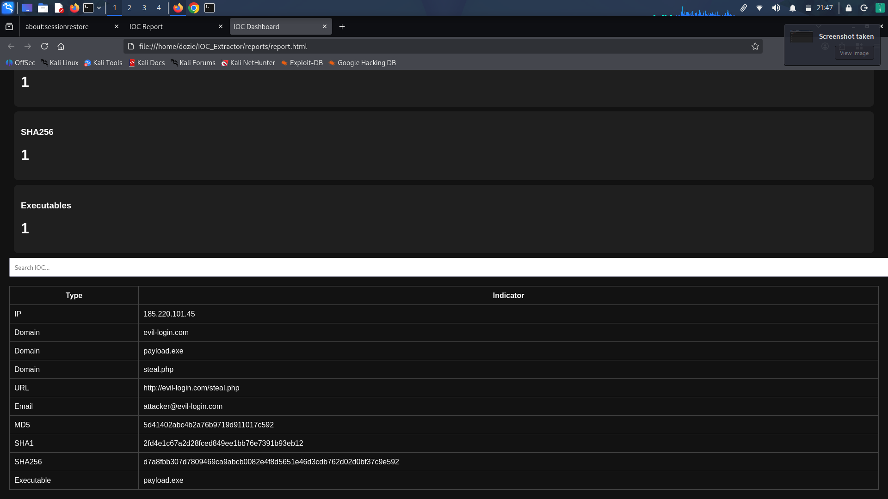
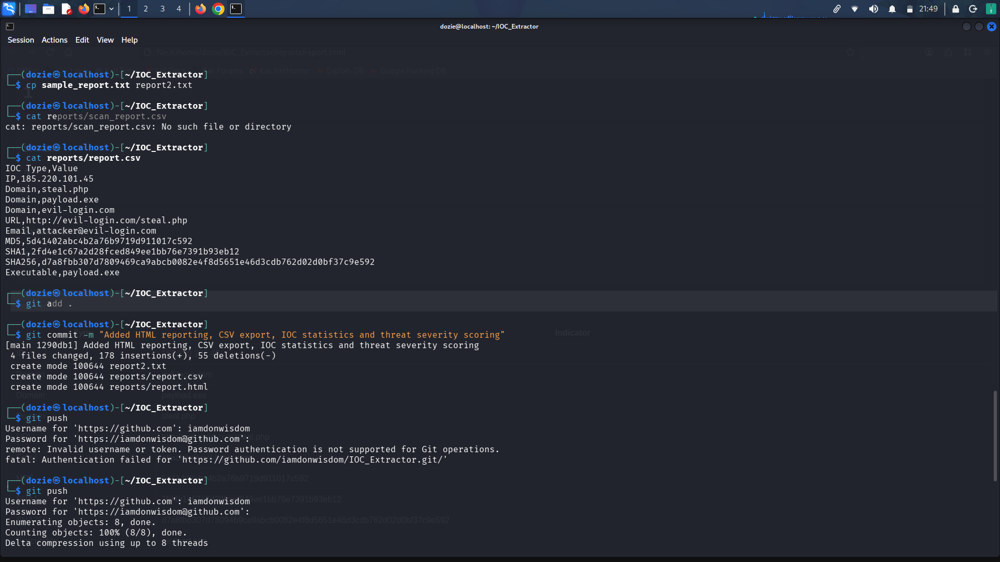
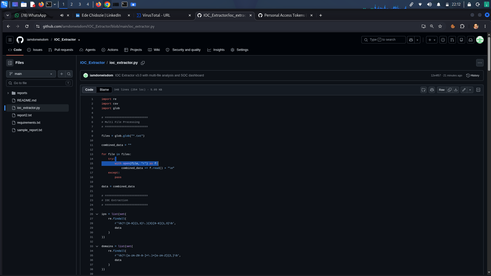
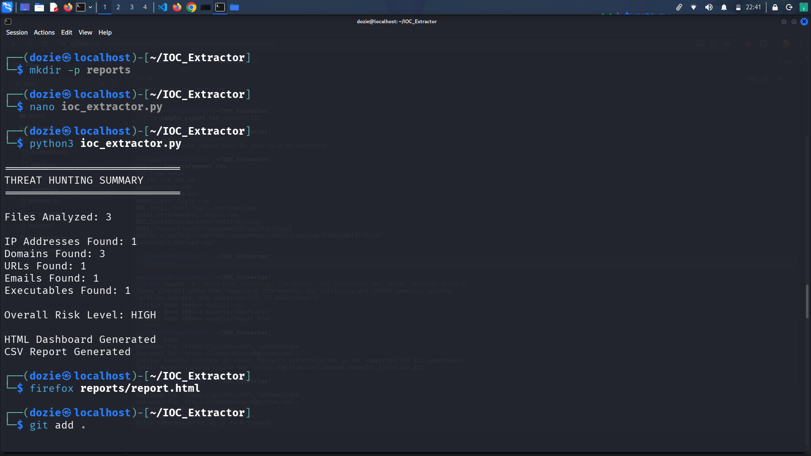

# IOC Extractor

A Python-based threat hunting and incident response tool that automatically extracts Indicators of Compromise (IOCs) from security reports and threat intelligence data.

## Features

- Multi-file IOC analysis
- IOC extraction using Regex
- Duplicate IOC removal
- Threat severity scoring
- CSV report export
- Dark-themed HTML dashboard
- Search and filter functionality
- Threat hunting summary generation

## Supported IOC Types

- IP Addresses
- Domains
- URLs
- Email Addresses
- MD5 Hashes
- SHA1 Hashes
- SHA256 Hashes
- Executable Files

## Project Structure

IOC_Extractor/
├── ioc_extractor.py
├── sample_report.txt
├── report2.txt
├── reports/
│   ├── report.csv
│   └── report.html
└── README.md

## Technologies Used

- Python 3
- Regular Expressions (Regex)
- CSV Module
- HTML/CSS
- Kali Linux
- VS Code
- Git & GitHub

## Sample Output

THREAT HUNTING SUMMARY

Files Analyzed: 2
IP Addresses Found: 1
Domains Found: 1
URLs Found: 1

Overall Risk Level: HIGH

## Screenshots

### Source Code

### Threat Hunting Summary

### IOC Dashboard

### Search & Filter Functionality

### GitHub Repository

##GitHub Repository

## Author

Ede Chidozie Philip

GitHub: https://github.com/iamdonwisdom

